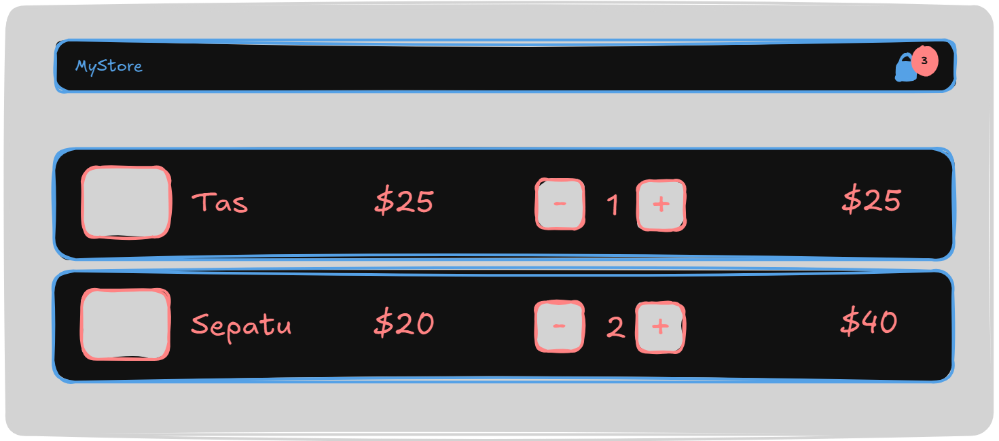

# Front End Web Dev Stage

## Technical Project Assignment (TPA) #4 - Cart App

Pada TPA-004 kalian diminta untuk membuat halaman keranjang belanja dengan menggunakan ReactJS.

### Specs

- Wajib menggunakan **functional component**
- Halaman website **minimum** terdiri dari 4 Component yaitu:
  - **Navbar**
  - **CartList**
  - **CartItem**
  - **Counter**
- Konten produk diambil dari API berikut https://fakestoreapi.com/products?limit=5
- **CartItem** menampilkan nama produk, gambar, harga satuan, counter/kuantitas, dan total harga (harga satuan * kuantitas)
- Masing-masing **Counter** (kuantitas produk) pada **CartItem**, akan mempengaruhi **total harga** dan angka keranjang belanja pada **Navbar**
- Gunakan state untuk menyimpan data
- Gunakan props untuk mengoper data

## Penilaian

Penilaian akan dilakukan dari beberapa hal:

1. Kode React.js yang terorganisasi dengan baik
2. Pemahaman dan implementasi component
3. Pemahaman dan penggunaan terhadap props, dan state
5. Website sudah di styling
6. Jumlah Component yang sesuai
7. Website berfungsi dengan semestinya
8. Kemampuan peserta menggunakan Git & GitHub
9. Kemampuan peserta dalam mendeploy aplikasi website

Good luck!
